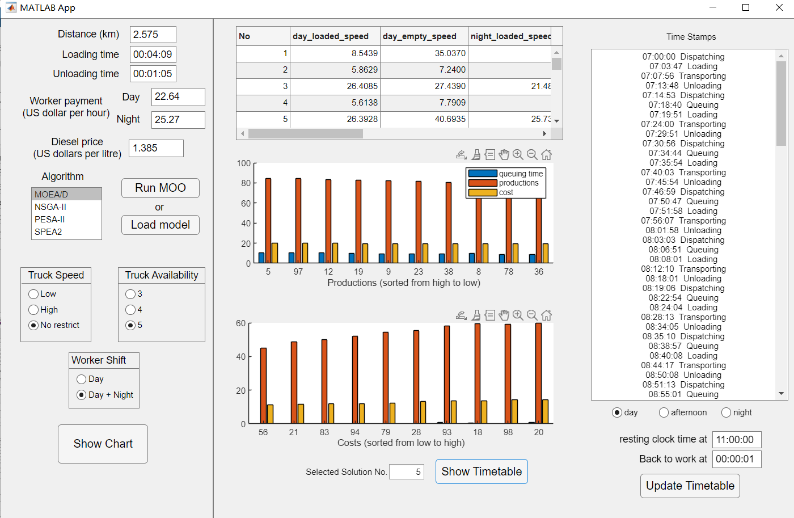

Introduction

This project presents a truck scheduling strategy for the open-pit mining industry. A multi-objective optimization (MOO) algorithm is proposed for truck scheduling, considering three objectives: minimizing queuing time, maximizing productivity, and minimizing financial cost. Specifically, the proposed algorithm continuously searches the solution space, with truck moving speed and payload chosen as operational variables.

The user application "truck_schedule.mlapp" features a user-friendly graphical interface. A video demo can be downloaded from the following link: [Video Demo](https://drive.google.com/file/d/1H5B6768DepKl1rBao_2tiJdONIFbn7Fs/view?usp=sharing).

Dataset

The dataset consists of mining operations data collected from a small-scale open-pit mine. The data are recorded by the Vital Information Management System (VIMS), a state-of-the-art onboard system used for monitoring truck systems and displaying abnormal system conditions. The VIMS data include three parts: payload productivity data, truck system data, and abnormal event data. Due to an agreement with the data provider, the database cannot be released.

Configuration

This project is partly based on the PlatEMO. Beofre using  this application, you should acknowledge the use of "PlatEMO" and reference "Ye Tian, Ran Cheng, Xingyi Zhang, and Yaochu Jin, PlatEMO: A MATLAB Platform for Evolutionary Multi-Objective Optimization [Educational Forum], IEEE Computational Intelligence Magazine, 2017, 12(4): 73-87".

Setting up the environment is straightforward:
1. Install PlatEMO from [GitHub](https://github.com/BIMK/PlatEMO).
2. Copy the source code to the main folder of "PlatEMO".
3. Copy the folder "Problems/open-pit" to "PlatEmo/Problems". Then you will be able to use the application.
After these steps, you will be able to use the application.

Copyright

If you find this opopen-source application useful, You are free to use the this application for research prupose only. All publications that use this code should referece "Y. Wang, W. Liu, C. Wang, F. Fadzil, S. Lauria and X. Liu. A novel multi-objective optimization approach with flexible operation planning strategy for truck scheduling. International Journal of Network Dynamics and Intelligence. DOI:10.53941/ijndi.2023.100002, 2023".
